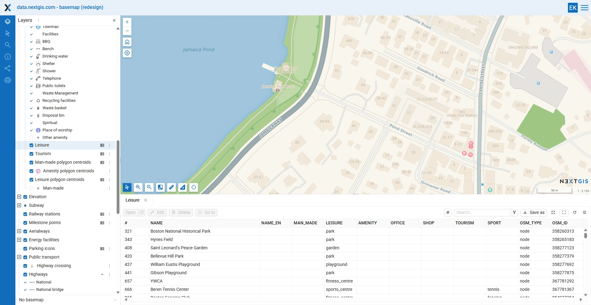
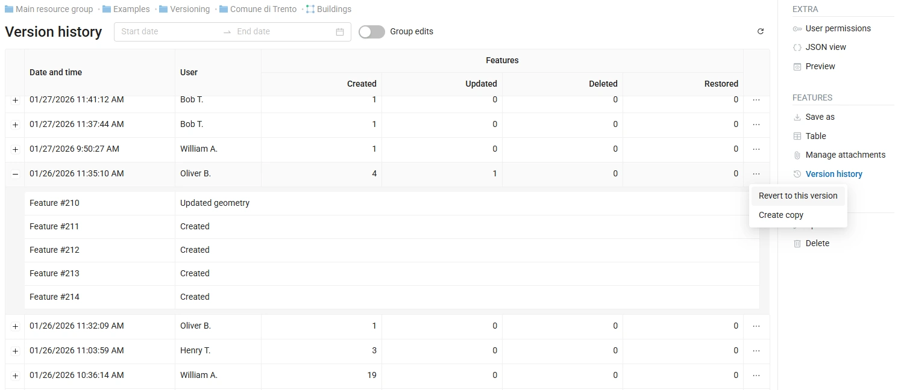

# NextGIS Web

)

**NextGIS Web** is an open-source Web GIS server for **geospatial data management**, **web map publishing**, and **QGIS-centered collaborative workflows**.

It combines a powerful spatial backend, a web-based interface for administration and map publishing, and a full REST API. Suitable for projects ranging from small teams to enterprise-grade GIS infrastructures.

## Table of contents

- [Key capabilities](#key-capabilities)
  - [Geospatial data management](#geospatial-data-management)
  - [Web map and data publishing](#web-map-and-data-publishing)
  - [QGIS-native collaboration](#qgis-native-collaboration)
  - [Built-in version control for vector data](#built-in-version-control-for-vector-data)
  - [Editing and attachments](#editing-and-attachments)
  - [Security and access control](#security-and-access-control)
  - [API and extensibility](#api-and-extensibility)
- [Documentation](#documentation)
- [Examples and live demo](#examples-and-live-demo)
- [Community and ecosystem](#community-and-ecosystem)
- [Commercial support](#commercial-support)
- [License](#license)

## Key capabilities

### Geospatial data management
- **Comprehensive vector and raster geodata storage**  
  Upload or create geospatial datasets and manage them as structured spatial databases via the web interface or REST API.

- **External PostGIS database connection**  
  Create vector layers backed by external PostGIS databases. Style them, publish them on Web Maps, and expose them via standard services.

- **Coordinate reference systems management**  
  Define custom CRS and use them consistently for measurement and data export.

---

### Web map and data publishing

- **Interactive Web Maps**  
  Create unlimited interactive Web Maps using the built-in map engine. Web Maps include layer management, advanced search, filtering, printing, and measurements.

- **Tile and OGC services publishing**  
  Publish data as:
  - Raster and vector tiles
  - OGC WMS, WMTS, WFS
  - OGC API – Features
  - Cloud Optimized GeoTIFF

- **External services support**  
  Connect third-party TMS, WMS, and WFS services and use them directly in Web Maps.

---

### QGIS-native collaboration

- **Full QGIS style support**  
  Use QGIS styles to visualize datasets.

- **Hub for QGIS-centered teamwork**  
  Publish QGIS projects to NextGIS Web and edit server-side data directly from QGIS using the [NextGIS Connect](https://github.com/nextgis/nextgis_connect) plugin.

  See the NGW/QGIS integration extension: [nextgisweb_qgis](https://github.com/nextgis/nextgisweb_qgis) 

---

### Built-in version control for vector data

- **Track the full history of vector datasets**  
  Who changed what, when, and how. Roll back changes or audit edits without data loss.

---

### Editing and attachments
- **Built-in vector layers editor**  
  Create and modify vector layers directly in the web interface.

- **Attachments management**  
  Attach photos and documents to vector layer features. Preview and manage attachments directly on Web Maps.

---

### Security and access control

- **Flexible permissions management**  
  Create users and groups with fine-grained access control, down to individual layers or maps.

---

### API and extensibility
- **Powerful REST API**  
  All functionality is accessible programmatically: users, layers, services, maps, permissions, and more.

- **Frontend integration**  
  Build custom web applications using [NextGIS JavaScript libraries](https://github.com/nextgis/nextgisweb_frontend)

## Documentation

📘 [User and admin documentation](https://docs.nextgis.com/docs_ngweb/source/index.html)

📗 [REST API reference](https://docs.nextgis.com/docs_ngweb_dev/doc/toc.html)

## Examples and live demo

🧪 [NextGIS Web interactive examples](https://demo.nextgis.com)

🏗️ [NextGIS Web sandbox](https://sandbox.nextgis.com)

## Community and ecosystem

💬 [NextGIS community forum](https://community.nextgis.com)

🐞 [GitHub issues and discussions](https://github.com/nextgis/nextgisweb/issues)

🧩 [NextGIS Connect - QGIS integration plugin](https://github.com/nextgis/nextgis_connect)

🎨 [Frontend libraries](https://github.com/nextgis/nextgisweb_frontend)

## Commercial support

Professional support, cloud and enterprise deployments, and consulting services are available from the NextGIS team.

☁️ [Ready-to-go cloud](https://nextgis.com/pricing-base/)

🏢 [On-premise deployment](https://nextgis.com/pricing/)

🌍 [NextGIS Website](https://nextgis.com)  

✉️ [Contact us](https://nextgis.com/contact/)

## License

NextGIS Web is released under the **GNU General Public License v3.0**.
